<div align="center">

<!-- BANNER · nube de puntos que recorre cinco transformaciones -->
<a href="https://github.com/LuisContreras73">
  <picture>
    <source media="(prefers-color-scheme: dark)" srcset="assets/banner-dark.svg">
    <source media="(prefers-color-scheme: light)" srcset="assets/banner-light.svg">
    
  </picture>
</a>

<br>

<a href="https://github.com/LuisContreras73">
  
</a>


</div>

---

<div align="center">

<!-- TERMINAL ANIMADA · ejecuta el pronostico y dibuja la banda con datos reales -->
<picture>
  <source media="(prefers-color-scheme: dark)" srcset="assets/inference-dark.svg">
  <source media="(prefers-color-scheme: light)" srcset="assets/inference-light.svg">
  
</picture>

<br><br>

<picture>
  <source media="(prefers-color-scheme: dark)" srcset="assets/operador-dark.svg">
  <source media="(prefers-color-scheme: light)" srcset="assets/operador-light.svg">
  
</picture>

</div>

<br>

<div align="center">

## `$ cat stack.yaml`

<table border="1" cellpadding="14">
  <thead>
    <tr><th colspan="2" align="left"><code>luis@lima:~$ cat stack.yaml</code></th></tr>
  </thead>
  <tbody>
    <tr>
      <td width="50%" valign="top"><code>├─ ◆ generative_models:</code><br><br>
        
        
        <br>
        <sub><code>Diffusion · VAE · Flow Matching · GANs</code></sub>
      </td>
      <td width="50%" valign="top"><code>├─ ∫ neural_operators:</code><br><br>
        
        
        <br>
        <sub><code>FNO · DeepONet · Neural ODE · operator learning</code></sub>
      </td>
    </tr>
    <tr>
      <td valign="top"><code>├─ ⬡ transformers_y_grafos:</code><br><br>
        
        
        <br>
        <sub><code>Attention · ViT · GNN (GCN/GAT) · Graph Transformers</code></sub>
      </td>
      <td valign="top"><code>├─ ◉ world_models_y_dinamica:</code><br><br>
        
        <br>
        <sub><code>Latent Dynamics · SINDy · PINNs · caos y memoria larga</code></sub>
      </td>
    </tr>
    <tr>
      <td valign="top"><code>├─ ≈ series_e_incertidumbre:</code><br><br>
        
        <br>
        <sub><code>Transformers temporales · LSTM/GRU · LightGBM · conformal · Optuna</code></sub>
      </td>
      <td valign="top"><code>├─ ▤ datos:</code><br><br>
        
        
        <br>
        <sub><code>SQL · PostgreSQL · DuckDB · xarray · Parquet</code></sub>
      </td>
    </tr>
    <tr>
      <td valign="top"><code>├─ ⬢ geoespacial:</code><br><br>
        
        <br>
        <sub><code>Earth Engine · QGIS · rasterio · GeoPandas · FEFLOW</code></sub>
      </td>
      <td valign="top"><code>├─ ⚙ ingenieria:</code><br><br>
        <br>
        <sub><code>Python · Ubuntu · Arch Linux · Git · GitHub Actions · Docker</code></sub>
      </td>
    </tr>
    <tr>
      <td colspan="2" valign="top"><code>╰─ ◈ campo_y_hardware:</code><br><br>
        
        
        
        <br>
        <sub><code>ESP32 · LoRa · sensores de nivel · Firebase RTDB · KiCad</code></sub>
      </td>
    </tr>
  </tbody>
</table>

</div>

<br>

## `$ ./inspect --model HydroST --show attention`

<div align="center">
  <picture>
    <source media="(prefers-color-scheme: dark)" srcset="assets/atencion-dark.png">
    <source media="(prefers-color-scheme: light)" srcset="assets/atencion-light.png">
    
  </picture>
</div>

> Nadie le dijo al modelo dónde nace el agua. Cuando llega una crecida, la atención
> espacial se desplaza del valle a las tres subcuencas de cabecera sobre los 4 000 m
> — **del 37 % al 48 %** — que son justo las que aportan el 56 % del caudal.
> Pesos reales extraídos de los checkpoints, no una ilustración.

<br>

## `$ ls -la proyectos/`

<table>
  <tr>
    <td width="56%" valign="top">

### 🏆 HidroAlerta Chancay–Huaral

Pronóstico de caudal y alerta temprana en una cuenca andina.
**Tres modelos, uno por escala de decisión:**

| Modelo | Plazo | Acierto |
|---|---|---|
| HydroST — atención espacial, 9 subcuencas | 1 día | NSE **0,97** |
| TFT canónico + GRU — subestacional | 14 días | NSE **0,76** |
| LightGBM cuantílico — disponibilidad | 1 mes | KGE **0,77** |

No entrega un número: entrega una **banda P10–P90** que después se
comprueba contra el nivel que mide un nodo IoT propio en campo.
Aguanta 30 días sin telemetría perdiendo solo 0,07 de NSE.

🥇 **1.er puesto** — Concurso de Ciencia y Tecnología para la Seguridad
Hídrica, Autoridad Nacional del Agua (2026). En implementación operativa.

[`código`](https://github.com/LuisContreras73/hidroalerta-chancay-huaral) ·
[`visor en vivo`](https://luiscontreras73.github.io/hidroalerta-dashboard)

### 📡 En curso

- **World models** para dinámica de sistemas físicos
- Escalado multi-cuenca con **CAMELS-PE** (136 cuencas)
- Operativización de HidroAlerta con la ALA Chancay–Huaral

  </td>
    <td width="44%" valign="top" align="center">

<picture>
  <source media="(prefers-color-scheme: dark)" srcset="assets/radar-dark.svg">
  <source media="(prefers-color-scheme: light)" srcset="assets/radar-light.svg">
  
</picture>

<div align="left">

```text
├─ operadores neuronales
│   FNO · DeepONet · Neural ODE
├─ modelos generativos
│   difusión · VAE · flow matching
├─ world models
│   dinámica latente aprendida
├─ dinámica no lineal
│   SINDy · caos · memoria larga
├─ grafos y atención
│   GNN · transformers
╰─ incertidumbre e interpretabilidad
    conformal · atención · VSN
```

</div>

  </td>
  </tr>
</table>

<br>

<div align="center">

## `$ contact --list`

<a href="https://www.linkedin.com/in/TU-USUARIO">
  
</a>
<a href="mailto:luis.contreras@utec.edu.pe">
  
</a>
<a href="https://luiscontreras73.github.io/hidroalerta-dashboard">
  
</a>
<a href="https://github.com/LuisContreras73">
  
</a>

<br><br>

<sub><code>« Un modelo que no se puede falsar no es un modelo. »</code></sub>

</div>
