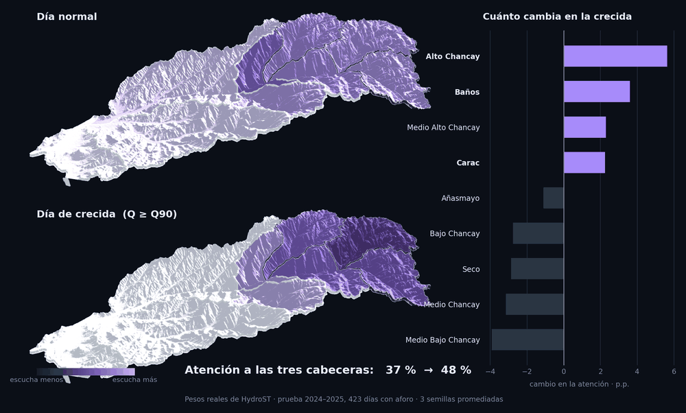
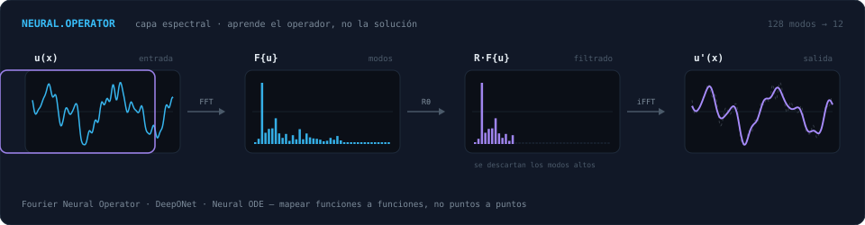
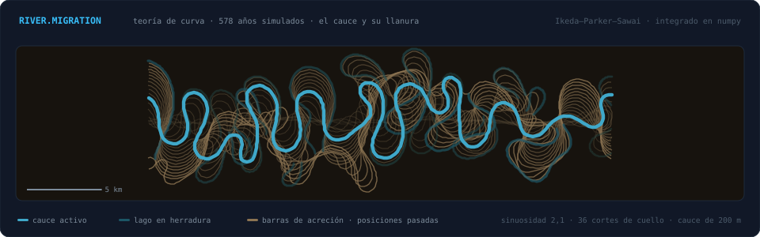

<!-- BANNER · nube de puntos que recorre cuatro transformaciones -->
<a href="https://github.com/LuisContreras73">
  <picture>
    <source media="(prefers-color-scheme: dark)" srcset="assets/banner-dark.svg">
    <source media="(prefers-color-scheme: light)" srcset="assets/banner-light.svg">
    
  </picture>
</a>

**Data Scientist** especializado en **recursos hídricos**. Ingeniero ambiental de formación.
Construyo modelos de agua que se pueden **verificar**: pronóstico de caudal, hidrogeología
numérica y aprendizaje de operadores, con el sensor en campo contrastando lo que el modelo
prometió.

---

## `$ ls -la proyectos/`

### 🏆 HidroAlerta Chancay–Huaral

Pronóstico de caudal y alerta temprana en una cuenca andina. **Tres modelos, uno por escala de decisión:**

| Modelo | Plazo | Acierto |
|---|---|---|
| **HydroST** — atención espacial sobre 9 subcuencas | 1 día | NSE **0,97** |
| **TFT canónico + GRU** — subestacional | 14 días | NSE **0,76** |
| **LightGBM cuantílico** — disponibilidad | 1 mes | KGE **0,77** |

No entrega un número: entrega una **banda P10–P90** que después se contrasta contra el nivel
que mide un nodo IoT propio en campo. Aguanta **30 días sin telemetría** perdiendo solo 0,07 de NSE.

🥇 **1.er puesto** — Concurso de Ciencia y Tecnología para la Seguridad Hídrica,
Autoridad Nacional del Agua (2026). En implementación operativa.

[`código`](https://github.com/LuisContreras73/hidroalerta-chancay-huaral) ·
[`visor en vivo`](https://luiscontreras73.github.io/hidroalerta-dashboard)

<picture>
  <source media="(prefers-color-scheme: dark)" srcset="assets/inference-dark.svg">
  <source media="(prefers-color-scheme: light)" srcset="assets/inference-light.svg">
  
</picture>

> En los 80 días del evento de enero–marzo de 2024 el caudal medido cayó dentro de la banda
> P10–P90 el **82,5 %** de las veces, contra el 80 % nominal. Fuera de eventos la banda queda
> corta y el modelo es sobre-confiado: está medido, está cuantificado y está en el informe.

### 📡 En curso

- **World models** para dinámica de sistemas físicos
- Escalado multi-cuenca con **CAMELS-PE** (136 cuencas peruanas)
- Operativización de HidroAlerta con la ALA Chancay–Huaral

 

## `$ ./inspect --model HydroST --show attention`

  <picture>
    <source media="(prefers-color-scheme: dark)" srcset="assets/atencion-dark.png">
    <source media="(prefers-color-scheme: light)" srcset="assets/atencion-light.png">
    
  </picture>

> Nadie le dijo al modelo dónde nace el agua. Cuando llega una crecida, la atención espacial se
> desplaza del valle a las tres subcuencas de cabecera sobre los 4 000 m — **del 37 % al 48 %** —
> que son justo las que aportan el 56 % del caudal.
> Pesos reales extraídos de los checkpoints, no una ilustración.

 

## `$ ./bench --topics`

Tres cosas que modelo, cada una con su simulación corriendo de verdad detrás:
aprender el **operador** en vez de la solución, el **río** que construye su propia
llanura, y el **agua dentro de una excavación minera**.

<picture>
  <source media="(prefers-color-scheme: dark)" srcset="assets/operador-dark.svg">
  <source media="(prefers-color-scheme: light)" srcset="assets/operador-light.svg">
  
</picture>

  

<picture>
  <source media="(prefers-color-scheme: dark)" srcset="assets/rio-dark.svg">
  <source media="(prefers-color-scheme: light)" srcset="assets/rio-light.svg">
  
</picture>

> Teoría de curva integrada en el tiempo — la migración de cada punto no responde a
> su curvatura local sino a la de **aguas arriba**, con memoria exponencial. Nadie
> dibujó los lagos en herradura: aparecen solos cuando un cuello se estrangula.
> 578 años, 36 cortes, sinuosidad 2,1.

<picture>
  <source media="(prefers-color-scheme: dark)" srcset="assets/tajo-dark.svg">
  <source media="(prefers-color-scheme: light)" srcset="assets/tajo-light.svg">
  
</picture>

> Las crestas no son círculos escalados: son curvas de nivel de un campo de
> distancias al cuerpo mineralizado, que es lo que hace que un tajo se vea
> excavado y no dibujado. La rampa da **una sola vuelta** porque el 10 % de
> pendiente y los 138 m de profundidad no dan para más.

 

## `$ cat stack.yaml`

<table border="1" cellpadding="14">
  <thead>
    <tr><th colspan="2" align="left"><code>luis@lima:~$ cat stack.yaml</code></th></tr>
  </thead>
  <tbody>
    <tr>
      <td width="50%" valign="top"><code>├─ ∫ operadores_neuronales:</code>  
        
        
         
        <code>FNO · DeepONet · Neural ODE · G: a(x) ↦ u(x)</code>
      </td>
      <td width="50%" valign="top"><code>├─ ◆ generativos:</code>  
        
        
         
        <code>Diffusion · VAE · Flow Matching</code>
      </td>
    </tr>
    <tr>
      <td valign="top"><code>├─ ⬡ transformers_y_grafos:</code>  
        
        
         
        <code>Attention · GNN (GCN/GAT) · TFT · conformal</code>
      </td>
      <td valign="top"><code>├─ ⌬ hidrogeologia_y_fisica:</code>  
        <code>∇·(K∇h) = Ss ∂h/∂t</code>  
        <code>FEFLOW · MODFLOW · GR4J · PINNs · balance hídrico</code>
      </td>
    </tr>
    <tr>
      <td valign="top"><code>├─ ▤ datos_y_geoespacial:</code>  
        
        
        
         
        <code>SQL · DuckDB · xarray · Earth Engine · QGIS · rasterio</code>
      </td>
      <td valign="top"><code>╰─ ⚙ ingenieria_y_campo:</code>  
        
         
        <code>Arch · Ubuntu · Git · Docker · ESP32 · LoRa · KiCad</code>
      </td>
    </tr>
  </tbody>
</table>

 

## `$ contact --list`

  

<code>« Un modelo que no se puede falsar no es un modelo. »</code>

